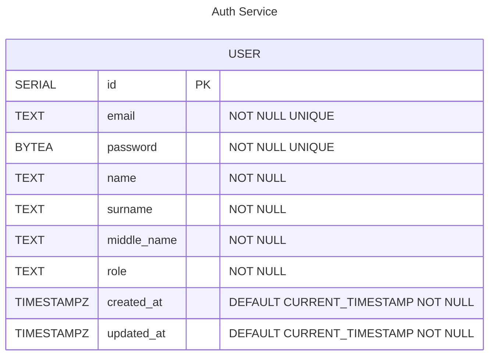

## ER 

```mermaid
---
title: Auth Service
---
erDiagram
     USER {
        SERIAL id PK
        TEXT email "NOT NULL UNIQUE"
        BYTEA password "NOT NULL UNIQUE"
        TEXT name "NOT NULL"
        TEXT surname "NOT NULL"
        TEXT middle_name "NOT NULL"
        TEXT role "NOT NULL"
        TIMESTAMPZ created_at "DEFAULT CURRENT_TIMESTAMP NOT NULL"
        TIMESTAMPZ updated_at "DEFAULT CURRENT_TIMESTAMP NOT NULL"
    }
```
